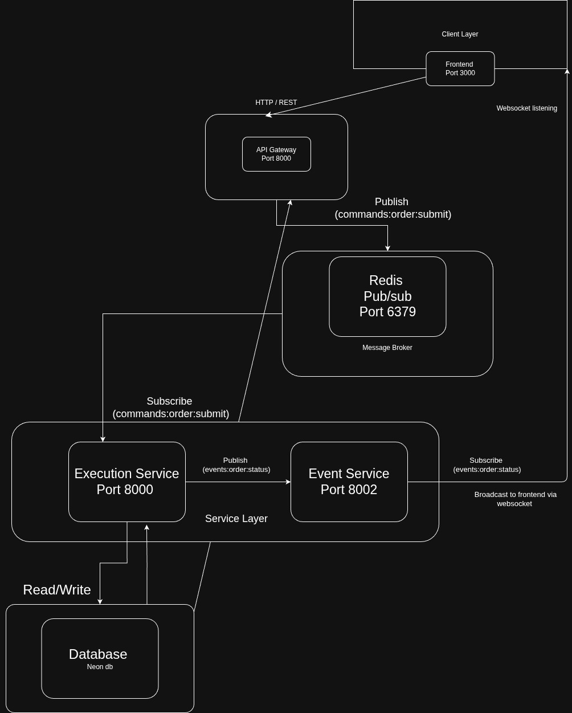

# 🚀 Cryptex - Real-Time Crypto Trading Platform (Testnet)

### A real-time full-stack microservices-based crypto trading simulator built using the Binance API.

## 🚀 Features

- 🔐 JWT-based authentication and authorization  
- 📊 Real-time price charts powered by WebSockets  
- ⚡ Instant order execution with live PnL tracking  
- 📈 Live updates for positions and trade history  
- 🔔 Real-time toast notifications  
- 🔄 Redis Pub/Sub for inter-service communication  
- 🔑 Secure password hashing using bcrypt  
- 🎨 Clean and responsive UI  

## 🧰 Tech Stack

### 🖥️ Frontend
- Nextjs 16 (App Router).
- Typescript.
- lightweight-charts.
- React-hot-toast.
- socket.io.
- Zod.
- React-redux.

### ⚙️ Backend
- Node.js.
- Expressjs.
- Redis.
- socket.io
- prisma.
- postgreSQL.

### 🏗️ Infastructure
- Docker & Docker Compose.
- Monorepo architecture using pnpm workspaces.

## 🏭 Architecture Overview


### 🔄 Data Flow

- **Frontend**: Next.js client with WebSocket connection  
- **API Gateway**: Handles incoming requests and publishes events to Redis Pub/Sub  
- **Execution Service**: Subscribes to channels, processes orders, interacts with Binance API & database, and publishes results  
- **Event Service**: Subscribes to execution updates and broadcasts them to clients via WebSockets  

## ⚙️ Setup Instructions

```bash
# Install dependencies
pnpm install

# Run services
pnpm dev

```

## 🔑 Environments Variables
```bash
PORT=
DATABASE_URL=
REDIS_URL=
JWT_SECRET=
BINANCE_API_KEY=
```


